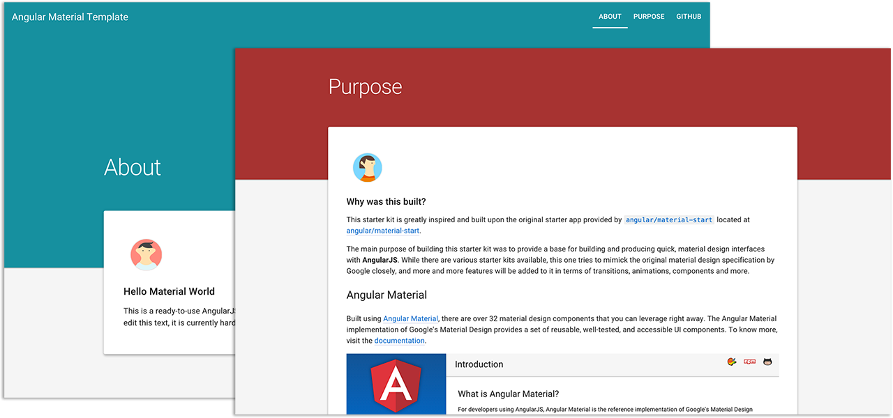

# Angular Material Seed

This project is a *seed* for AngularJS Material Design applications. 

The project contains a sample AngularJS application built on Google's Material Design specification, and is preset to install the AngularJS framework and a bunch of development and testing tools for instant web development gratification.

This sample application is intended to be useful as both a learning tool and a skeleton application for a typical [AngularJS Material](http://material.angularjs.org/) web app: comprised of a top navigation header area and a content area. You can use it to quickly bootstrap your AngularJS webapp projects and dev
environment for these projects.

### How does it look?

Below is a screenshot of the Starter-App:

<br/>



## Getting Started

#### Prerequisites

You will need **git** to clone the repository. You can get git from
[http://git-scm.com/](http://git-scm.com/).

We also use a number of node.js tools to initialize and test the project. You must have node.js and its package manager (npm) installed.  You can get them from [http://nodejs.org/](http://nodejs.org/).

#### Clone The App

To get you started you can simply clone `master` branch from the
[Angular Material Seed](https://github.com/ritenv/angular-material-seed) repository and install the dependencies:

Clone the repository using [git][git]:

```
git clone https://github.com/ritenv/angular-material-seed.git
cd angular-material-seed
```

#### Installing Dependencies

There are two kinds of dependencies in this project: tools and AngularJS framework code. The tools help us manage and test the application.

* We get the tools we depend upon via `npm`, the [node package manager][npm].
* We get the AngularJS code via `bower`, a [client-side code package manager][bower].

We have preconfigured `npm` to automatically run `bower` so we can simply do:

```
npm install

npm install --global live-server
```

Behind the scenes this will also call `bower install`.  You should find that you have two new
folders in your project.

* `node_modules` - contains the npm packages for the tools we need
* `app/bower_components` - contains the AngularJS framework files

### Running the app

```
live-server ./app
```

### Run End-to-End Tests

To run your e2e tests your should install and configure Protractor and the Selenium WebServer. These are already specified as npm dependencies within `package.json`. Simply run these terminal commands:

```console
npm install -g live-server
npm update
webdriver-manager update
```

Your can read more details about Protractor and e2e here: http://angular.github.io/protractor/#/ for more details on Protractor.

 1. Start your local HTTP Webserver: `live-server` or `http-server`.

```console
cd ./app; live-server;
```

> Note: since `live-server` is working on port 8080, we configure the `protractor.conf.js` to use
`baseUrl: 'http://localhost:8080'`

 2. In another tab, start a Webdriver instance:
 
```console
webdriver-manager start
```

>This will start up a Selenium Server and will output a bunch of info logs. Your Protractor test
will send requests to this server to control a local browser. You can see information about the
status of the server at `http://localhost:4444/wd/hub`. If you see errors, verify path in
`e2e-tests/protractor.conf.js` for `chromeDriver` and `seleniumServerJar` to your local file system.

 3. Run your e2e tests using the `test` script defined in `package.json`:
 
```console
npm test
```

> This uses the local **Protractor** installed at `./node_modules/protractor`

## Directory Layout

```
app/                    --> all of the source files for the application
  assets/app.css        --> default stylesheet
  src/           --> all app specific modules
  index.html            --> app layout file (the main html template file of the app)
karma.conf.js         --> config file for running unit tests with Karma
e2e-tests/            --> end-to-end tests
  protractor-conf.js    --> Protractor config file
  scenarios.js          --> end-to-end scenarios to be run by Protractor
```

## Technology Links

For more information on AngularJS please check out http://angularjs.org/
For more information on Angular Material, check out https://material.angularjs.org/

[git]: http://git-scm.com/
[bower]: http://bower.io
[npm]: https://www.npmjs.org/
[node]: http://nodejs.org
[protractor]: https://github.com/angular/protractor
[jasmine]: http://jasmine.github.io
[karma]: http://karma-runner.github.io
[travis]: https://travis-ci.org/
[http-server]: https://github.com/nodeapps/http-server

## Credits

This starter kit is built upon the original starter app provided by <code>angular/material-start</code> located at <a href="https://github.com/angular/material-start" target="_blank">angular/material-start</a>. The primary target of this seed app is to enhance the UI to match the Material Design specification.

## Background

**Angular Material Seed** is being developed by [@ritenv](http://twitter.com/@ritenv) as a hobby project. If you have any ideas, suggestions or things you'd like to see in this app, PM me directly at [@ritenv](http://twitter.com/@ritenv).