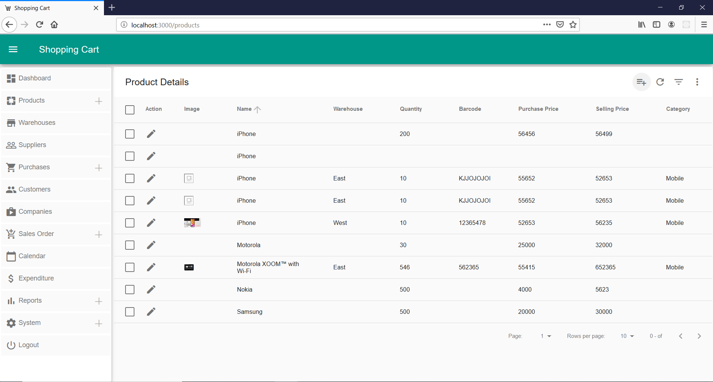

## Shopping Cart

#### Project Description

> Shopping application developed on AngularJS, AngularJS Material, NodeJS and MySQL. 

#### Installation & Setup

1. `Run install`
2. `node server.js`

#### Tools and Technologies

- Technology: AngularJS, HTML, SCSS, NodeJS
- Middleware: ExpressJS
- Database : MySQL

 

#### Resources

* [AngularJS v1.7x](https://code.angularjs.org/snapshot-stable/docs/tutorial/step_00)
* [AngularJS Material](https://material.angularjs.org/latest/)
* [HammerJS](https://hammerjs.github.io/)
* [Sass](https://sass-lang.com/)
* [Webpack](https://webpack.js.org/)
* [Typescript](https://www.typescriptlang.org/)

#### Project Output

